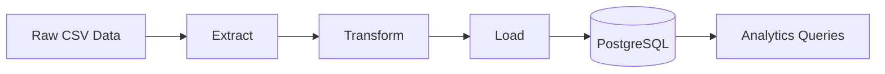
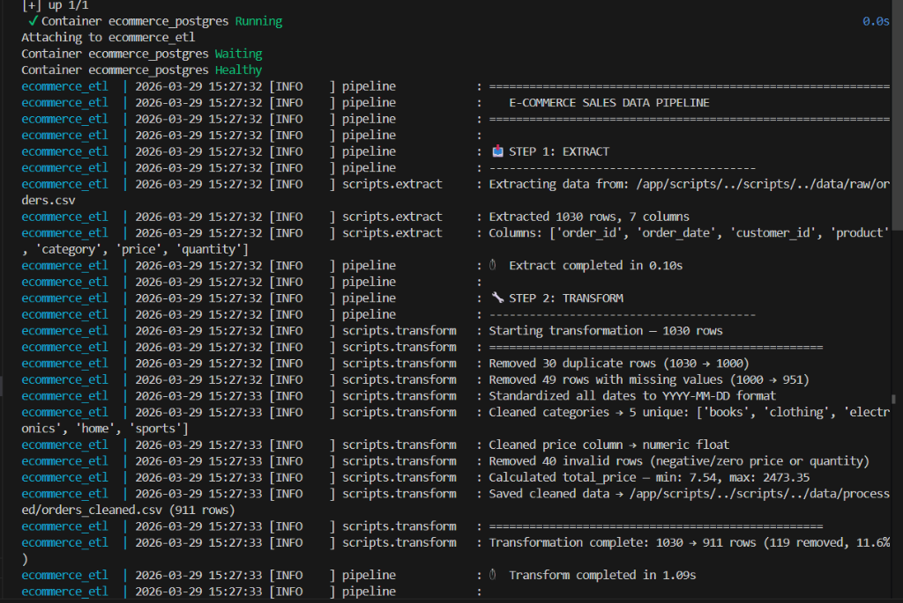
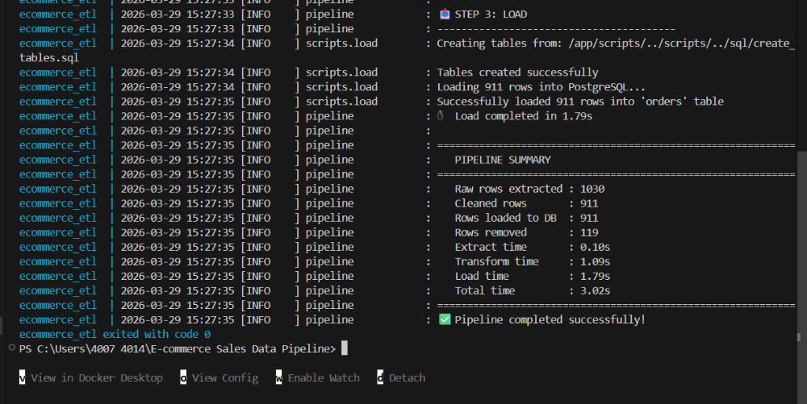
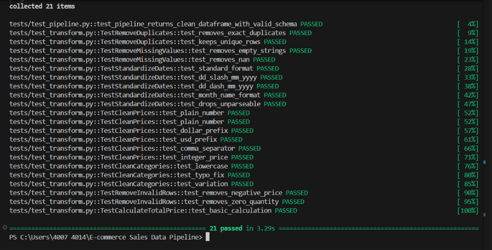
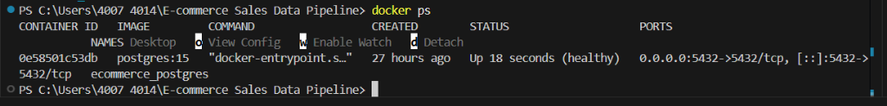
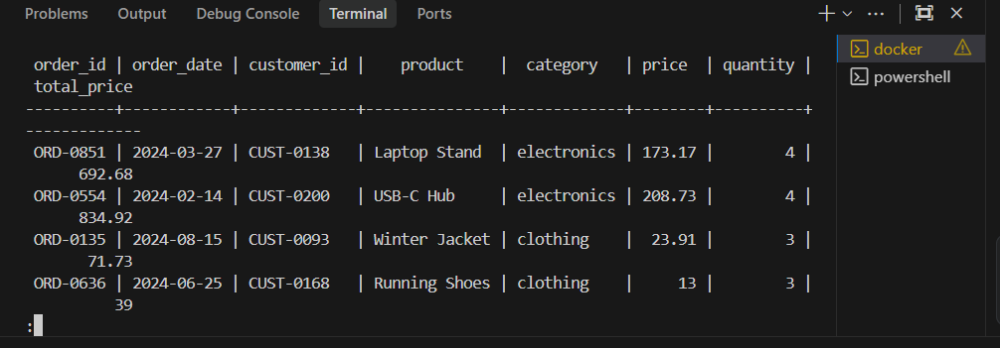
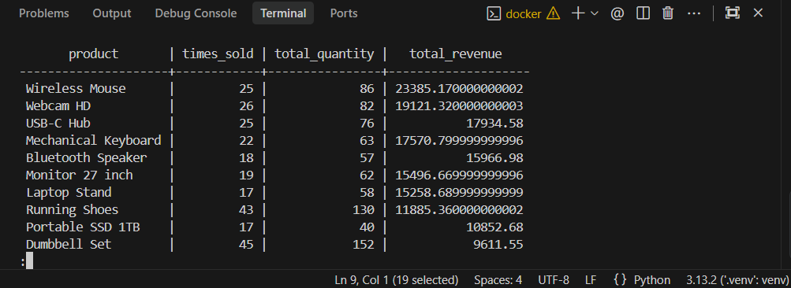
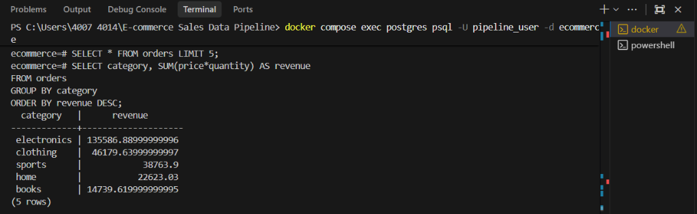
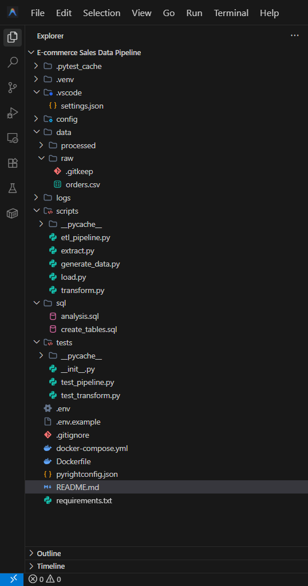

# E-commerce Sales ETL Pipeline

This project is an end-to-end ETL (Extract, Transform, Load) pipeline for e-commerce sales data. It processes raw transaction records from CSV files, performs data cleaning and transformation using Python, and loads the structured data into a PostgreSQL database for analytical purposes.

This project demonstrates core data engineering practices including data cleaning, automated testing, and containerized deployment. It ensures that raw, inconsistent data is converted into a reliable, "analytics-ready" dataset for business intelligence queries.

## Architecture

The following diagram illustrates the data flow from source to the final analytical storage:



## Tech Stack

* **Python (pandas)**: Core ETL logic and data transformation.
* **PostgreSQL**: Analytical database (Target storage).
* **Docker & Docker Compose**: Environment orchestration and containerization.
* **pytest**: Automated unit and integration testing.
* **SQL**: Schema definition and analytical queries.

## Pipeline Overview

### Extract
The extraction phase involves reading raw transaction records from a local CSV file. The system implements structured logging to track the number of rows and columns identified at the point of ingestion.

### Transform
Data transformation is performed using pandas to ensure integrity and consistency. The following operations are applied:
* **Remove duplicates**: Identifies and drops exact duplicate records.
* **Remove missing values**: Filters out rows with missing critical information.
* **Standardize date formats**: Converts various date strings into native datetime objects.
* **Rule-based category normalization**: Maps inconsistent category names to a standard taxonomy.
* **Clean price column**: Strips currency symbols and converts string values to numeric (float).
* **Remove invalid rows**: Filters out records with negative or zero price/quantity.
* **Feature Engineering**: Calculates `total_price` based on price and quantity.

### Load
The loading phase uses SQLAlchemy to manage database connections and bulk-insert the cleaned DataFrame into a PostgreSQL orders table, **ensuring schema consistency and reproducibility.**

## Example Data (Raw vs Cleaned)

Below is an example of the inconsistent raw data handled by the pipeline:

| order_id | product | category (dirty) | price (dirty) |
| :--- | :--- | :--- | :--- |
| ORD-101 | Laptop Stand | tech | $29.99 |
| ORD-102 | USB-C Hub | Electronics | 45.00 |
| ORD-103 | Wireless Mouse | electronics | $ 15.50 |

**What the pipeline fixes:**
- **Normalization**: Maps "tech" and "electronics" (lowercase) to a standard "electronics" category.
- **Price Cleaning**: Strips currency symbols ($) and whitespace, converting values to a standard numeric format for calculation.
- **Consistency**: Ensures all date and string formats are uniform across the entire dataset.


## Example Pipeline Run

The pipeline provides structured logging to show how raw data is progressively cleaned and refined at each step.

```text
Raw rows extracted : 1030
Cleaned rows       : 911
Rows loaded to DB  : 911
Rows removed       : 119
```

### Execution Logs (Full Trace)



## Testing

Automated testing is a core component of this pipeline to ensure data reliability. The test suite includes:
* **Unit tests**: Validating individual transformation functions (e.g., price cleaning, date parsing).
* **Integration test**: Verification of the full ETL flow from extraction to final refined DataFrame.
* **CI-friendly environment**: Tests are designed to run without a live database dependency by utilizing mocked or intermediate dataframes.

Implementing automated testing ensures that any changes to the transformation logic do not introduce data regressions. **These tests act as automated data quality checks to prevent regressions in transformation logic.**



## Running with Docker

The project uses Docker Compose to orchestrate the environment, allowing for one-command execution that handles:
1. Starting the PostgreSQL container.
2. Initializing the analytical schema.
3. Running the ETL pipeline script.



## How to Run the Project

Follow these steps to set up and run the ETL pipeline locally:

1. **Clone the repository:**
   ```bash
   git clone https://github.com/fahad-codes01/E-commerce-Sales-Data-Pipeline.git
   cd E-commerce-Sales-Data-Pipeline
   ```

2. **Configure Environment:**
   - Copy `.env.example` to `.env`.
   - Fill in your database credentials in the `.env` file (default values are optimized for Docker).

3. **Deploy with Docker:**
   ```bash
   docker compose up --build
   ```

4. **Automated Execution:**
   The pipeline will execute automatically once the containers are healthy, extracting the raw CSV, cleaning the data, and loading it into the PostgreSQL instance.


## Example Analytics Queries

Once the data is loaded into PostgreSQL, it can be queried to provide business insights:
* **Revenue by category**: Identifying the highest-grossing product categories.
* **Top products by revenue**: Ranking products based on total sales performance.

### SQL Query Results




## Project Structure

The project follows a modular structure to separate concerns:
* `config/`: Database connection settings.
* `data/`: Raw and processed data storage.
* `scripts/`: Python modules for Extract, Transform, and Load logic.
* `sql/`: SQL scripts for schema creation and analysis.
* `tests/`: Automated test suite.



## Future Improvements

* **Workflow Orchestration**: Add workflow scheduling and monitoring with Apache Airflow.
* **Cloud Migration**: Migrate data storage to cloud-native solutions (e.g., AWS S3 + Redshift or Google BigQuery).
* **Incremental Loading**: Implement Change Data Capture (CDC) or incremental loading instead of full batch loads.
* **dbt Integration**: Add a dedicated data transformation layer with dbt for more complex modeling.

> [!NOTE]
> **Terminal & Environment Tip:** If you are on Windows and encounter permission issues in PowerShell (e.g. unable to run .ps1 scripts), consider switching to **Git Bash** or **WSL2** for a smoother Unix-like experience. For PATH-related issues, ensure that Python and Docker are properly added to your System PATH.